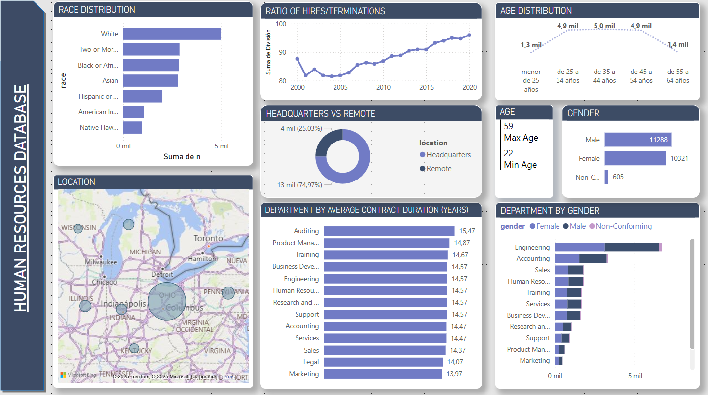

> **Base de datos utilizada:** `mi_base_de_datos`
> **Descripción:** Conjunto de datos de clientes con información de compras.

## 1. **Renaming the "human resources" table to avoid issues with spaces:**

   We use the following SQL command to rename the table:

   ```sql
   ALTER TABLE `proyecto`.`human resources` 
   RENAME TO `proyecto`.`human_resources`;
   ```

## 2. **Checking the number of records in the human_resources table:**

We use the following SQL command to count the rows:

```sql 
SELECT count(*) FROM human_resources;
```

This gives us a total of 22,214 records.

## 3. **Checking the table structure:**


A quick look reveals some issues with data encoding.

## 4. **Re-encoding**

### 4.1 **id Column**
   
   Since this will be our primary key, we start by checking that there are no null values:

```sql 
   SELECT * FROM human_resources WHERE id IS NULL;
```

For the same reason, we check that there are no duplicate IDs:

```sql
    SELECT count(id) "id_duplicados" FROM human_resources 
    GROUP BY id 
    HAVING count(id)>1;
```

We define id as a primary key, with unique and non-null values (we also need to change its data type from text to varchar):

```sql
    ALTER TABLE human_resources 
	MODIFY id VARCHAR(20) NOT NULL UNIQUE, 
	ADD PRIMARY KEY (id);
```

### 4.2 **first_name and last_name Columns**

We check that there are no records with empty first or last names:

```sql
    SELECT * FROM human_resources 
    WHERE first_name OR last_name IS NULL;
```  

We modify these variables:

```sql
    ALTER TABLE human_resources 
	MODIFY first_name VARCHAR(30) NOT NULL, 
    MODIFY last_name VARCHAR(60) NOT NULL, 
```

### 4.3 **birthday and hire_date Columns**


The birthday column contains dates in the MM-DD-YYYY and MM/DD/YYYY formats. The following code converts both formats to DD-MM-YYYY.

**NOTE: Since this involves modifying sensitive data, we always use a TRANSACTION context, performing a commit if the changes are successful and a rollback if errors are found.**

```sql
UPDATE human_resources
SET birthdate = CASE
    WHEN birthdate LIKE '%/%' THEN DATE_FORMAT(STR_TO_DATE(birthdate, '%m/%d/%Y'), '%Y-%m-%d')
    WHEN birthdate LIKE '%-%' THEN DATE_FORMAT(STR_TO_DATE(birthdate, '%m-%d-%Y'), '%Y-%m-%d')
    ELSE birthdate  
END;
```

After executing this command, we standardize the column, obtaining the following result:


A similar issue occurs with the hire_date column. We apply an equivalent transformation:

```sql
UPDATE human_resources
SET hire_date = CASE
    WHEN hire_date LIKE '%/%' THEN DATE_FORMAT(STR_TO_DATE(hire_date, '%m/%d/%Y'), '%Y-%m-%d')
    WHEN hire_date LIKE '%-%' THEN DATE_FORMAT(STR_TO_DATE(hire_date, '%m-%d-%Y'), '%Y-%m-%d')
    ELSE hire_date  
END;
```

Finally, we convert the values to the DATE data type:

```sql
ALTER TABLE human_resources 
	MODIFY birthdate DATE, 
    MODIFY hire_date DATE;
```

### 4.4 **gender, race, department, jobtitle, location, location_city, and location_state Columns**

To check for syntax errors in the categorical values, we use the following code:


```sql
SELECT DISTINCT gender FROM human_resources;
SELECT DISTINCT race FROM human_resources;
SELECT DISTINCT department FROM human_resources;
SELECT DISTINCT jobtitle FROM human_resources;
SELECT DISTINCT location FROM human_resources;
SELECT DISTINCT location_city FROM human_resources;
SELECT DISTINCT location_state FROM human_resources;
```
Now, we convert the data type to VARCHAR:

```sql
ALTER TABLE human_resources
MODIFY gender VARCHAR(40),
MODIFY race VARCHAR(100),
MODIFY department VARCHAR(100),
MODIFY jobtitle VARCHAR(100),
MODIFY location VARCHAR(100),
MODIFY location_city VARCHAR(100),
MODIFY location_state VARCHAR(100);
```


### 4.5 **Age Column**

We want to create a column representing the employee's age. We use the following command:

```sql
START TRANSACTION;
ALTER TABLE human_resources
ADD COLUMN age int NULL;
UPDATE human_resources
SET age = TIMESTAMPDIFF(YEAR, birthdate, CURDATE());
```

After doing this, we find that some ages are negative because their birthdates are later than the current date. We keep the birthdate but remove the incorrect age values to maintain data integrity.

```sql
UPDATE human_resources
SET age = CASE
WHEN age<0 THEN NULL
ELSE age
END;
```

### 4.6 **termdate Column**

We remove the UTC part, convert empty values to NULL, and change the data type to DATETIME:

```sql
UPDATE human_resources  
SET termdate = CASE
    WHEN termdate = '' THEN NULL
    ELSE termdate
END;
UPDATE human_resources  
SET termdate = STR_TO_DATE(SUBSTRING(termdate, 1, 19), '%Y-%m-%d %H:%i:%s')
WHERE termdate LIKE '%UTC%';
SELECT * FROM human_resources;
ALTER TABLE human_resources  
MODIFY COLUMN termdate DATETIME;
```

## 5. Some Analyses::

### 5.1 Gender Distribution of Employees.  

Since this is a group we will frequently analyze, we create a view for active employees (over 18 years old and without a termination date):

```sql 
CREATE VIEW active_workers AS
SELECT * FROM human_resources
WHERE age>18 AND termdate = "";
```

Now, we check the gender distribution:

```sql 
SELECT gender, COUNT(gender) "n", ROUND(COUNT(gender) * 100 / SUM(COUNT(gender)) OVER (), 2) "%" 
FROM active_workers
GROUP BY gender
```


We have a total of 50.97% men, 46.28% women, and the rest non-binary.

### 5.2 Racial/Ethnic Distribution of Employees  

```sql 
SELECT 
    race, 
    COUNT(race) AS "n", 
    ROUND(COUNT(race) * 100.0 / SUM(COUNT(race)) OVER (), 2) AS "percentage"
FROM active_workers 
GROUP BY race 
ORDER BY 3 DESC;
```


### 5.3 Age Distribution of Employees

We check the minimum and maximum ages:

```sql 
SELECT 
   MAX(age) as age_max,
   MIN(age) as age_min
FROM active_workers;
```


We create age categories:

```sql 
SELECT CASE
    WHEN age < 25 THEN "menor de 25 años"
    WHEN age >= 25 AND age < 35 THEN "de 25 a 34 años"
    WHEN age >= 35 AND age < 45 THEN "de 35 a 44 años"
    WHEN age >= 45 AND age < 55 THEN "de 45 a 54 años"
    WHEN age >= 55 AND age < 64 THEN "de 55 a 64 años"
    ELSE "65 años o más"
END AS age_cat,
COUNT(*)
FROM active_workers 
GROUP BY age_cat 
ORDER BY COUNT(*) DESC;
```


### 5.4 Comparison of the Number of Employees at Headquarters and Remote Locations.

```sql 
SELECT location, COUNT(*) FROM active_workers
GROUP BY location
```


### 5.5 Average Job Tenure for Terminated Employees.

```sql
SELECT AVG(DATEDIFF(termdate, hire_date))/365 "Average_job_lenght"
FROM human_resources
WHERE termdate < curdate() AND age>=18;
```


### 5.6 Gender Distribution Variation Across Departments and Job Titles.  

```sql
SELECT department, gender, count(gender) "n", count(gender)/SUM(count(gender)) OVER () * 100 "perc" 
FROM human_resources 
GROUP BY department, gender;
```


### 5.7 Job Title Distribution Across the Company.  

```sql
SELECT jobtitle, count(jobtitle) "n", count(jobtitle)/SUM(count(jobtitle)) OVER () * 100 "perc" 
FROM active_workers
GROUP BY jobtitle;
```


### 5.8 Department with the Highest Turnover Rate.  

```sql
SELECT department,
	total_count,
    terminated_count,
    terminated_count/total_count AS termination_rate
FROM(
	SELECT department,
    count(*) AS total_count,
    SUM(CASE WHEN termdate IS NOT NULL AND termdate <= curdate() THEN 1 else 0 end) AS terminated_count
    FROM human_resources
    WHERE age >= 18
    GROUP BY department)
    AS subquery
ORDER BY termination_rate DESC;
```


### 5.9 Employee Distribution by Location by State.  

```sql
SELECT location_state, COUNT(*) "n"
FROM active_workers
GROUP BY location_state
ORDER BY COUNT(*) DESC;
```


### 5.10 Evolution of the Number of Employees Based on Hiring and Termination Dates.  

```sql
SELECT
	year,
    hires,
    terminations,
    hires-terminations AS net_change,
    round((hires-terminations)/hires*100,2) AS net_cange_perc
FROM(
	SELECT YEAR (hire_date) AS year,
    COUNT(*) AS hires,
    SUM(CASE WHEN termdate IS NOT NULL AND termdate<= CURDATE() THEN 1 else 0 END) AS terminations
    FROM human_resources
    WHERE age >= 18
    GROUP BY YEAR(hire_date)
    ) AS subquery
ORDER BY year ASC;
```


### 5.11 Tenure Distribution by Department.

```sql
SELECT
    department,
    AVG(years_worked) AS average_years_working
FROM(
	SELECT 
    department,
    ROUND(DATEDIFF(curdate(),hire_date)/360) AS "years_worked"
    FROM active_workers
) AS subquery
GROUP BY department
ORDER BY average_years_working DESC;
```


## 6. Results

After completing the calculations, we can export the query results to a .CSV file and create a simple Power BI dashboard to present the findings.

